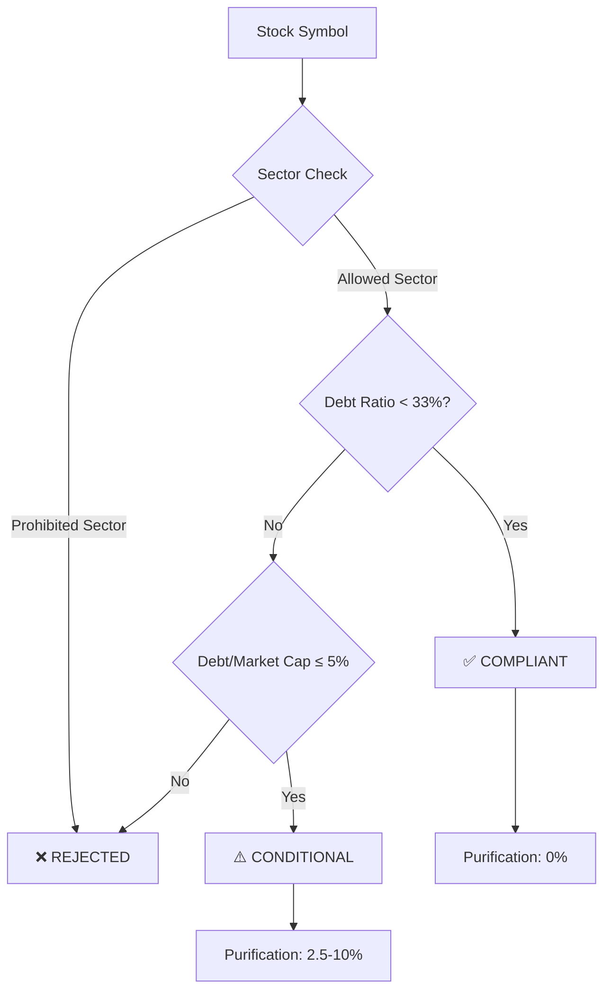

# Islamic Sharia-Compliant Stock Screener

A standalone, open-source tool for screening stocks based on Sharia compliance using the AAOIFI methodology.

## 🚀 Quick Start

```bash
# Clone and install
git clone https://github.com/your-repo/sharia-screener.git
cd sharia-screener
python -m venv venv
source venv/bin/activate  # or: venv\Scripts\activate
pip install -r requirements.txt

# Run the scanner
python src/scanner.py --symbol AAPL
```

## 📊 Features

- ✅ **Real-time data** via yfinance (no API key needed)
- ✅ **AAOIFI methodology** for Sharia screening
- ✅ **Business sector filtering** (alcohol, banks, insurance, etc.)
- ✅ **Financial ratio validation** (debt-to-market-cap < 33%)
- ✅ **Purification amount calculation** for non-compliant revenue
- ✅ **Flowchart visualization** of compliance logic
- ✅ **Batch screening** for multiple stocks
- ✅ **Export results** to JSON/CSV

## 🔍 Compliance Logic Flow



## 📋 Screening Rules

### Prohibited Industries (Immediate Rejection)
- Alcohol & Tobacco
- Banking, Finance & Insurance
- Gambling & Casinos
- Weapons & Military Contracting
- Adult Entertainment

### Financial Ratios
| Metric | Threshold | Purpose |
|--------|-----------|---------|
| Debt/Market Cap | < 33% | Standard AAOIFI limit |
| Cash Reserves | Track separately | Purification calculation |
| Interest Income | < 5% of revenue | Must be purified |

### Purification (Washing) Amount
- Calculate % of non-compliant revenue
- Donate proportionate amount from dividends/profits
- Formula: `purification_amount = dividend × (non_compliant_revenue / total_revenue)`

## 🛠️ Usage Examples

### Single Stock Analysis
```bash
python src/scanner.py --symbol AAPL --detailed
```

### Batch Screening
```bash
python src/scanner.py --symbols AAPL,MSFT,GOOGL --export results.json
```

### Generate Flowchart
```bash
python src/flowchart_generator.py --output compliance-flow.png
```

## 📦 Output Format

```json
{
  "symbol": "AAPL",
  "status": "COMPLIANT",
  "business_screen": "PASS",
  "financial_screen": "PASS",
  "debt_to_market_cap": 1.72,
  "non_compliant_revenue_pct": 0.0,
  "purification_ratio": 0.05,
  "screening_date": "2026-03-08T03:05:21Z",
  "notes": "Clean business model, low debt"
}
```

## 🌐 Integration

Use as a Python library:

```python
from src.screener import ShariaScreener

screener = ShariaScreener()
result = screener.check_stock("AAPL")

if result.is_compliant:
    print(f"✅ {result.symbol} is Sharia-compliant")
    print(f"   Purification ratio: {result.purification_ratio:.2%}")
else:
    print(f"❌ {result.symbol} rejected: {result.rejection_reason}")
```

## 📚 Methodology

This tool implements the **AAOIFI (Accounting and Auditing Organization for Islamic Financial Institutions)** Sharia screening standards, widely accepted in Sunni scholarship.

## 🔗 Related Projects

- [Alpaca API](https://alpaca.markets/) - Trading platform
- [yfinance](https://github.com/ranaroussi/yfinance) - Free market data
- [Zoya.finance](https://zoya.finance/) - Alternative commercial screener

## 📄 License

Apache 2.0 - Feel free to use, modify, and distribute!
